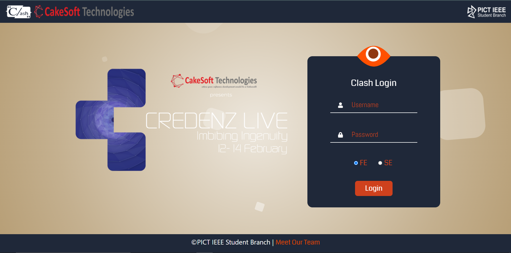
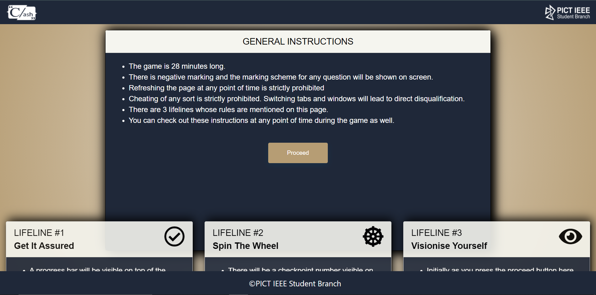
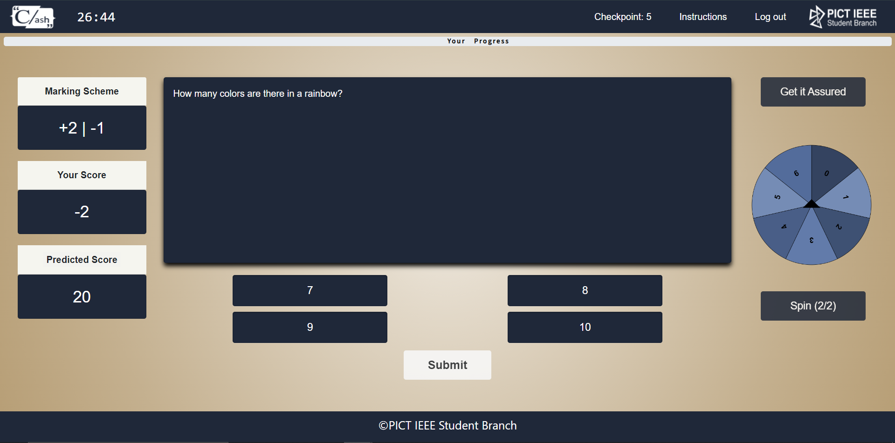
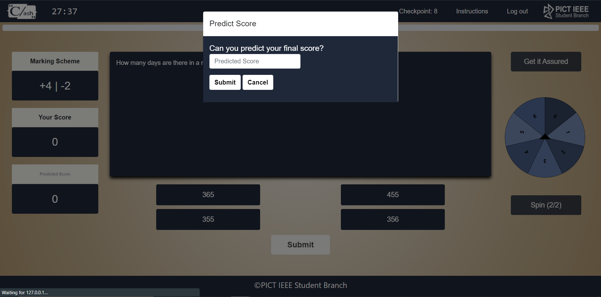
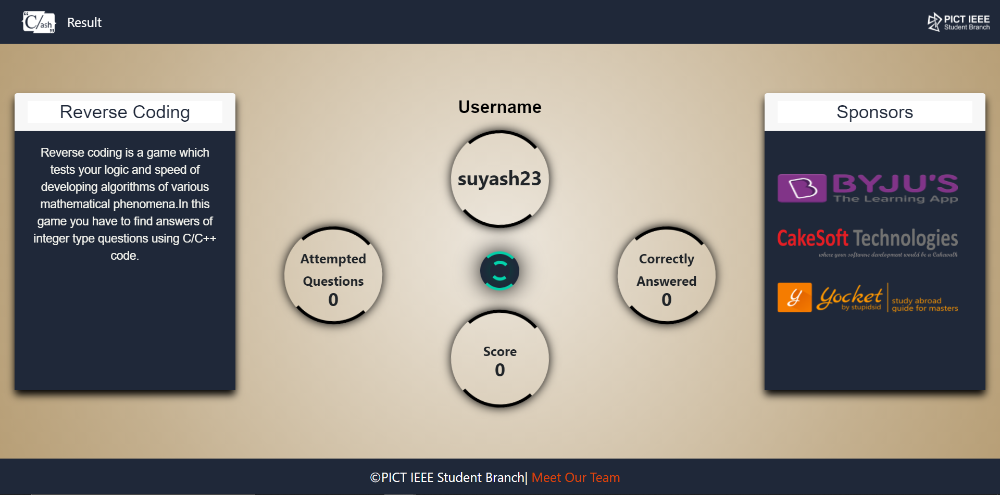

# CLASH CREDENZ 20'

### Working project of Clash which is a technical MCQ based event in Credenz organised by PICT IEEE Student Branch

## Steps to run project:

* To install pip: (Ubuntu)
```sh 
$ sudo apt install python3-pip
```
* Follow [this link](https://pip.pypa.io/en/stable/installing/) for installation of pip in windows
* To install virtualenv: 
```sh 
$ sudo pip3 install virtualenv
```
* To start virtualenv: 
```sh 
$ virtualenv venv
```
OR
* In windows to make a venv:
```sh
$ py -m venv venv
```
* To activate virtualenv: 
```sh 
source venv/bin/activate
```
OR
```sh
$ venv\Scripts\activate
```
* To deactivate virtualenv: 
```sh 
$ deactivate
```
* To install requirements and run project: 
    1. Activate virtualenv
    2. To install dependencies required **pip3 install -r requirements.txt**
    3. Run **python manage.py makemigrations**
    4. Run **python manage.py migrate** to make migrations
    5. Add a few questions in the database to see functioning
    6. To run clash **python manage.py runserver**
    7. Enjoy!

## Technology Used:

* **Front end:**
  1. HTML5
  2. CSS3
  3. Javascript and AJAX
  
* **Back end:**
  1. Django 3.1.0 (Python web framework)
 
* **Database used:**
  1. SQLite3
 
## Modules Used:

* User authentication
* Timer
* Conditional controlling of HTML elements
* Tab change handling (to prohibit copy)
* 8 lifelines were applied as follows :
``` 
   1. Reattempting a question
   2. -5 from the total score 
   3. Freezing time
   4. -8 +4 marking scheme for the questions
   5. No negative marking for next 3 Questions
   6. No spin here after
   7. +16 -10 marking scheme for the current question
   8. And last one was get assured which allows user to mark 2 answers for same question if he is not sure about it.
```
## Snippets of the project:

### 1. Login page


### 2. Instruction page


### 3. Questions page


### 4. Predict Score page


### 5. Result Page


## Create A PIPELINE
I have used [SEMAPHORECI](https://semaphoreci.com/) for the CI/CD.

Take a look at the [Dockerfile](https://github.com/suyash-more/CLASH/blob/finalestbranch/Dockerfile) which helps to build the project and help 
to build project at a greater pace.

Make a new project and tap into a new pipeline. 
At the start block download the python modules needed for project.

Put this in the Job Command section of build job:
```
sem-version python 3.7
checkout
mkdir .pip_cache
cache restore
pip install --cache-dir .pip_cache -r requirements.txt
cache store
```

Add another block for testing, checklist and style check(optional)

After adding new block add the following config lines to prologue section:
```
sem-version python 3.7
checkout
cache restore
pip install --cache-dir .pip_cache -r requirements.txt
```

Now in the unit test job add following config lines to the command section:
```
cd clash
python manage.py makemigrations
python manage.py migrate
python manage.py test
```

Now in the checklist job add following config lines to the command section:
``` 
cd clash
python manage.py check --deploy
```

Now in the checklist job add following config lines to the command section:
``` 
pip install flake8
flake8 clash/ --max-line-length=127
```
(We have not added this block in this CI/CD)

This library checks your code quality.

Allow build dependencies.

Use django.default file to direct traffic toward the webserver.
```
# nginx.default

server {
    listen 8020;
    server_name example.org;

    location / {
        proxy_pass http://127.0.0.1:8010;
        proxy_set_header Host $host;
        proxy_set_header X-Forwarded-For $proxy_add_x_forwarded_for;
    }
    location /static {
        root /opt/app/clash;
    }
}

```
Create shell fle to create a superuser and start the gunicorn web-server.
```
#!/usr/bin/env bash
# start-server.sh
if [ -n "$DJANGO_SUPERUSER_USERNAME" ] && [ -n "$DJANGO_SUPERUSER_PASSWORD" ] ; then
    (cd clash; python manage.py createsuperuser --no-input)
fi
(cd clash; gunicorn clash.wsgi --user www-data --bind 0.0.0.0:8010 --workers 3) &
nginx -g "daemon off;"
```

Now you can get the built artifact / image directly on dockerhub.

Make secret in the secret section of semaphorci.

Add a PROMOTION to the pipeline first.

Specify the branch to build and the result needed to proceed.
Allow the automatic push at dockerhub.

Add follwoing to the prologue section of promotion job:
```
sem-version python 3.7
checkout
cache restore
mkdir -p .pip_cache
pip install --cache-dir .pip_cache -r requirements.txt
cd clash
python manage.py makemigrations 
python manage.py migrate
cd ..
```

Now in the promotion build job add following config lines to the command section:
``` 
echo "${DOCKER_PASSWORD}" | docker login -u "${DOCKER_USERNAME}" --password-stdin
docker pull $DOCKER_USERNAME/clash:latest || true
docker build --cache-from=$DOCKER_USERNAME/clash:latest -t $DOCKER_USERNAME/clash:latest .
docker push $DOCKER_USERNAME/clash:latest
```

DockerHub Secret must be provided in case to push the build to dockerhub.
Enable the secret usage of dockerhub.

Push your build image at local PC to dockerhub with the name your provded 
in the job command section.


__PIPELINE IS ALL UP!!__

### TO GET THE IMAGE DIRECTLY USE THE FOLLOWING COMMAND

```
$ docker pull siddharthbora/clash
```
